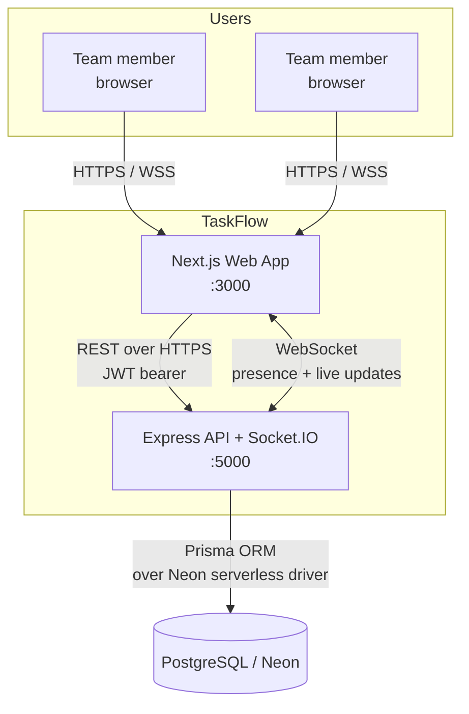
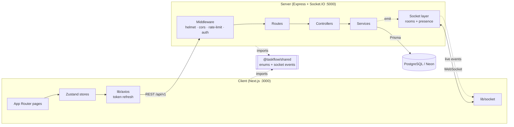
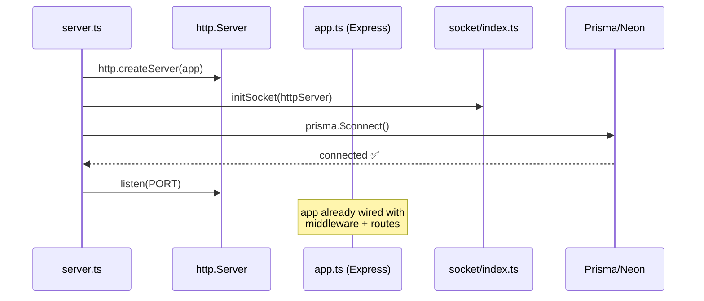
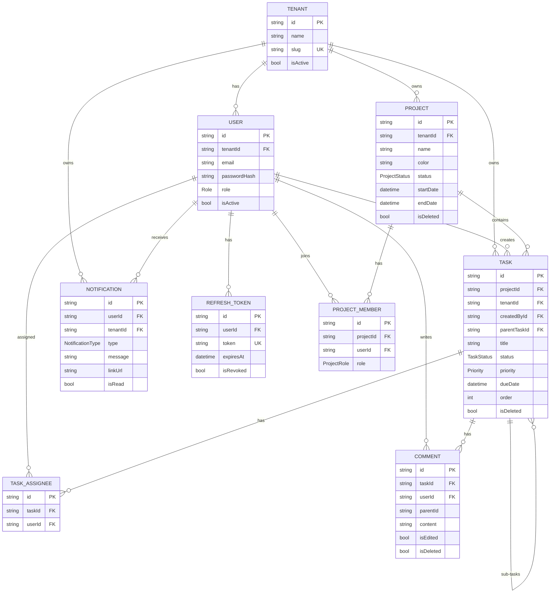
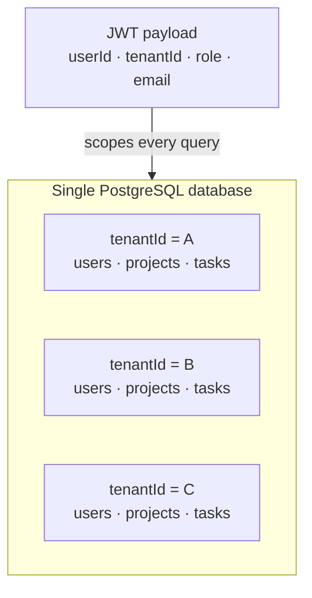
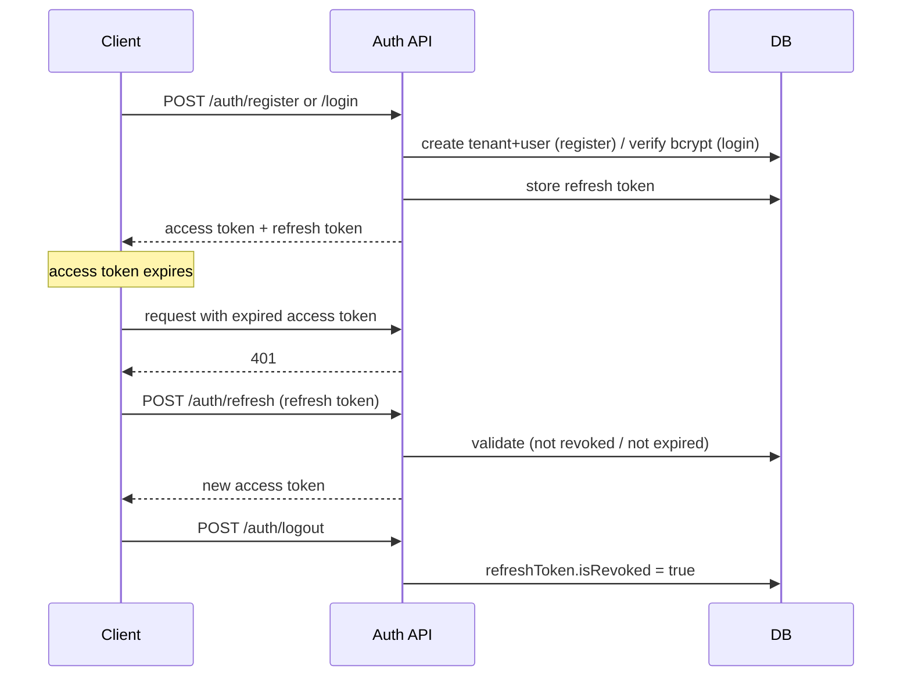
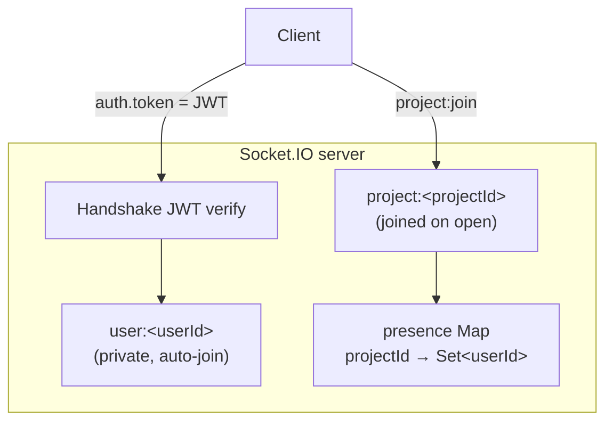
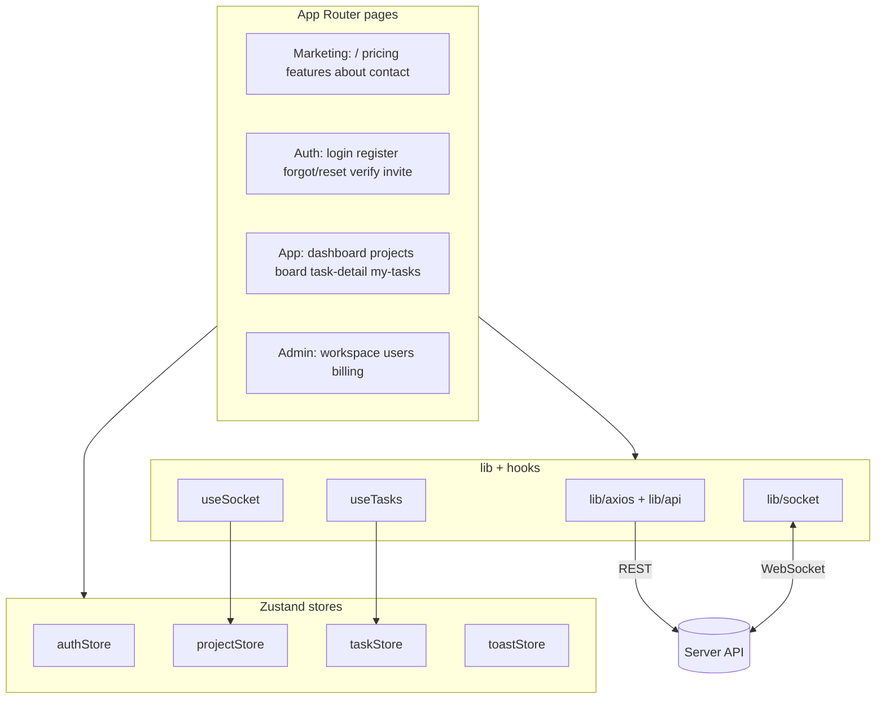
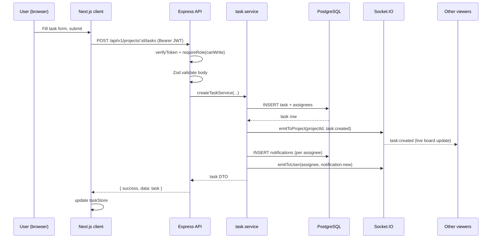
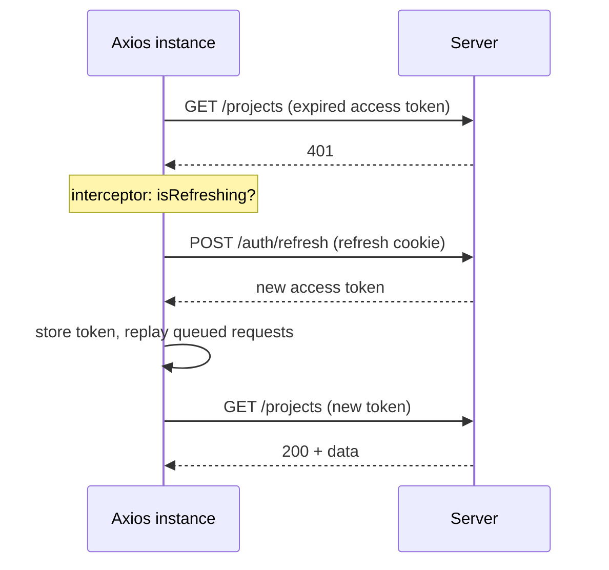

# TaskFlow — System Architecture

> A complete architectural reference for **TaskFlow**, a multi-tenant SaaS for
> team project- and task-management with a Kanban board, real-time
> collaboration, role-based access control, and notifications.
>
> **Audience:** engineers onboarding to the codebase, reviewers, and anyone
> who needs to understand how the system fits together end to end.
>
> **Companion docs:** [`README.md`](README.md) (product overview),
> [`DOCUMENTATION.md`](DOCUMENTATION.md) (technical reference),
> [`API_LIST.md`](API_LIST.md) (API/socket reference),
> [`FRONTEND_PAGES.md`](FRONTEND_PAGES.md) (page inventory).

---

## Table of contents

1. [System overview](#1-system-overview)
2. [Technology stack](#2-technology-stack)
3. [Repository structure](#3-repository-structure)
4. [High-level architecture](#4-high-level-architecture)
5. [The shared contract (`@taskflow/shared`)](#5-the-shared-contract-taskflowshared)
6. [Backend architecture](#6-backend-architecture)
7. [Data model](#7-data-model)
8. [Multi-tenancy model](#8-multi-tenancy-model)
9. [Authentication & authorization](#9-authentication--authorization)
10. [Real-time architecture](#10-real-time-architecture)
11. [Frontend architecture](#11-frontend-architecture)
12. [Cross-cutting concerns](#12-cross-cutting-concerns)
13. [Representative request flows](#13-representative-request-flows)
14. [Configuration & environments](#14-configuration--environments)
15. [Scalability, limitations & roadmap](#15-scalability-limitations--roadmap)

---

## 1. System overview

TaskFlow lets a team sign up as an **organization (tenant)**, get an isolated
workspace, invite members, and manage work on a Kanban board. Every
organization's data is fully isolated from every other tenant.



**Core capabilities**

| Capability | Summary |
| --- | --- |
| Multi-tenancy | Each org is a `Tenant`; every record carries a `tenantId` and queries are scoped to the caller's tenant. |
| Projects & tasks | Projects group work; tasks live on a Kanban board (`TODO → IN_PROGRESS → IN_REVIEW → DONE`, plus `BLOCKED`), support sub-tasks, priority, due dates, and multiple assignees. |
| Real-time collaboration | Socket.IO broadcasts task/project changes and live presence to everyone viewing a project. |
| Notifications | Per-user alerts for assignments, comments, mentions, due-soon, and member-joined events. |
| RBAC | Org-level roles (`OWNER`→`VIEWER`) and project-level roles guard every write. |
| Security | JWT access/refresh tokens, bcrypt password hashing, Helmet headers, CORS allow-listing, rate limiting. |

---

## 2. Technology stack

| Layer | Technology | Notes |
| --- | --- | --- |
| **Frontend** | Next.js 14 (App Router), React 18 | Server- and client-component model |
| | Zustand 5 | Lightweight global state (auth, projects, tasks, toasts) |
| | Tailwind CSS 3 | Utility-first styling |
| | Axios | REST client with token-refresh interceptor |
| | socket.io-client 4 | Real-time channel |
| | react-hot-toast | Toast notifications |
| **Backend** | Node.js + Express 5 | HTTP API |
| | Socket.IO 4 | WebSocket server (presence + live updates) |
| | Zod 4 | Request input validation |
| | jsonwebtoken | JWT issue/verify |
| | bcryptjs | Password hashing (cost 12) |
| | Helmet, cors, express-rate-limit | Security middleware |
| **Database** | PostgreSQL (Neon) | Serverless Postgres |
| | Prisma 7 ORM | Schema, migrations, type-safe client |
| | `@prisma/adapter-neon` + `ws` | Neon serverless driver over WebSocket |
| **Shared** | `@taskflow/shared` | Single source of truth for enums & socket-event names |
| **Tooling** | TypeScript 5, ts-node-dev, npm workspaces | Monorepo with shared types |

---

## 3. Repository structure

This is an **npm workspaces monorepo** with three packages — `shared`,
`server`, and `client` — that share a single dependency tree.

```
taskflow-saas/
├── package.json              # workspace root: dev / build / db scripts
├── shared/                   # @taskflow/shared — enums, statuses, socket events
│   └── index.ts
├── server/                   # Express + Socket.IO API
│   ├── prisma/
│   │   ├── schema.prisma     # data model + enums
│   │   └── migrations/       # SQL migration history
│   └── src/
│       ├── server.ts         # process entry: HTTP server + socket bootstrap
│       ├── app.ts            # Express app: middleware + route mounting
│       ├── config/           # env loader, Prisma/Neon client
│       ├── middleware/       # verifyToken, requireRole, error handler, 404
│       ├── modules/          # feature modules (see below)
│       ├── socket/           # Socket.IO server, rooms, presence, broadcasts
│       ├── helpers/          # error normalizers (Zod, Prisma, cast, dup)
│       ├── utils/            # AppError, catchAsync, sendResponse
│       └── types/            # ambient types & enums
└── client/                   # Next.js 14 web app
    ├── app/                  # App Router pages (marketing, auth, app core)
    ├── components/           # UI, layout, tasks, auth components
    ├── store/                # Zustand stores
    ├── hooks/                # useSocket, useTasks
    └── lib/                  # axios, api, socket, helpers
```

### Backend feature modules

Each module is a self-contained vertical slice:

```
modules/<feature>/
├── <feature>.route.ts        # HTTP paths, methods, auth/role middleware
├── <feature>.controller.ts   # parse/validate request → call service → respond
├── <feature>.service.ts      # business logic + Prisma data access + side effects
└── <feature>.model.ts        # Zod input schemas (DTO validation)
```

Modules present: `auth`, `project`, `task`, `notification`, `users`.

---

## 4. High-level architecture



**Two communication channels between client and server:**

1. **REST** (`/api/v1/*`) — all CRUD; stateless, authenticated per request with
   a JWT bearer token.
2. **WebSocket** (Socket.IO) — presence and live task/project/notification
   updates; authenticated once at the handshake with the same JWT.

The **shared package** is imported by both sides so that an enum value or
socket-event name is defined exactly once and never drifts.

---

## 5. The shared contract (`@taskflow/shared`)

`shared/index.ts` is the **single source of truth**. It exports frozen constant
objects (and derived TypeScript union types) consumed by both client and
server:

| Export | Purpose |
| --- | --- |
| `ROLES` | Org-level roles: `OWNER`, `ADMIN`, `MANAGER`, `MEMBER`, `VIEWER` |
| `PROJECT_ROLES` | Project-level roles: `MANAGER`, `MEMBER`, `VIEWER` |
| `PROJECT_STATUS` | `ACTIVE`, `ON_HOLD`, `COMPLETED`, `ARCHIVED` |
| `TASK_STATUS` | `TODO`, `IN_PROGRESS`, `IN_REVIEW`, `DONE`, `BLOCKED` |
| `BOARD_COLUMNS` | Ordered Kanban columns (`TODO → IN_PROGRESS → IN_REVIEW → DONE`) |
| `PRIORITY` / `PRIORITY_ORDER` | `LOW`, `MEDIUM`, `HIGH`, `URGENT` |
| `NOTIFICATION_TYPES` | `TASK_ASSIGNED`, `TASK_COMMENTED`, `DUE_SOON`, `MENTIONED`, `MEMBER_JOINED` |
| `SOCKET_EVENTS` | Wire names for every socket event (`task:created`, `presence:update`, …) |
| `PAGINATION` | Defaults & caps (`DEFAULT_LIMIT = 50`, `MAX_LIMIT = 200`) |

**Convention:** no enum value, status string, or socket-event name may be
hardcoded anywhere else — always import it from this package. The Prisma schema
mirrors these enums in the database.

---

## 6. Backend architecture

### 6.1 Layered design

The server follows a strict layering inside each feature module:

| Layer | Responsibility | Must **not** |
| --- | --- | --- |
| **Route** | Declare path, HTTP method, and attach middleware (`verifyToken`, `requireRole`) | Contain business logic |
| **Controller** | Validate input with the Zod model, call the service, shape the response via `sendResponse`, wrapped in `catchAsync` | Touch the database directly |
| **Service** | Business logic, Prisma access, side effects (socket emits, notifications) | Know about `req`/`res` |
| **Model** | Zod schemas for request bodies/queries | Contain logic |

Supporting layers:

| Layer | Files | Role |
| --- | --- | --- |
| **Middleware** | `verifyToken`, `requireRole`, `globalErrorHandler`, `notFound` | Auth, RBAC, error funnel |
| **Config** | `env.ts`, `prisma.ts` | Validated env vars, Prisma/Neon client singleton |
| **Utils** | `AppError`, `catchAsync`, `sendResponse` | Consistent errors & responses |
| **Helpers** | Zod / Prisma duplicate / cast / validation normalizers | Translate raw errors into clean API errors |
| **Socket** | `socket/index.ts` | Rooms, presence, broadcast helpers |

### 6.2 Application bootstrap



`server.ts` creates the HTTP server, attaches Socket.IO to the *same* server
(so REST and WebSocket share one port), verifies the database connection, then
starts listening. `app.ts` wires middleware and mounts routes.

### 6.3 Middleware pipeline (per REST request)

```
helmet → cors → morgan → express.json(10mb) → cookieParser
       → rateLimit(100/min) → [route-level verifyToken] → [requireRole]
       → controller → (service) → sendResponse
                                ↘ (error) → globalErrorHandler
```

### 6.4 Route mounting

| Prefix | Module | Auth |
| --- | --- | --- |
| `/api/v1/auth` | auth | public (register/login/refresh), authed (logout/me) |
| `/api/v1/projects` | project | `verifyToken` on the whole router |
| `/api/v1/projects/:projectId/tasks` | task (nested via `mergeParams`) | inherits project auth |
| `/api/v1/notifications` | notification | authed |
| `/api/v1/users` | users | authed |
| `/`, `/health` | app.ts | public |

Task routes are **nested** under projects: the project router does
`router.use("/:projectId/tasks", taskRoutes)` and the task router uses
`Router({ mergeParams: true })` to read `:projectId` from its parent.

### 6.5 Error handling

All controllers are wrapped in `catchAsync` so thrown/rejected errors flow to a
single `globalErrorHandler`, which normalizes:

- `AppError` (explicit `statusCode` + message),
- Zod validation errors,
- Prisma `P2002` (duplicate) and `P2023` (invalid id/cast),
- generic `Error` (→ 500),

into the uniform response shape and only leaks stack traces in development.

---

## 7. Data model

PostgreSQL via Prisma. Every business entity carries a `tenantId` for
isolation; `Project`, `Task`, and `Comment` use **soft deletes** (`isDeleted`).



**Key constraints & design points**

| Entity | Notable rules |
| --- | --- |
| `User` | Unique `(tenantId, email)` — same email may exist in different tenants. |
| `Tenant` | Unique `slug` (derived from org name + base-36 timestamp at registration). |
| `Task` | Self-relation `parentTaskId → subTasks` enables a one-level sub-task tree; ordered by `order` then `createdAt`. |
| `ProjectMember` / `TaskAssignee` | Join tables with unique compound keys to prevent duplicate membership/assignment. |
| Cascade deletes | Deleting a `Tenant`/`User`/`Project`/`Task` cascades to dependent rows (refresh tokens, members, assignees, comments) at the DB level. |
| Soft delete | `Project`, `Task`, `Comment` set `isDeleted = true`; queries filter `isDeleted: false`. |

The Prisma client is generated to `server/src/generated/prisma` and used
through a singleton (`config/prisma.ts`).

---

## 8. Multi-tenancy model

TaskFlow uses a **shared-database, shared-schema** multi-tenancy strategy with
a discriminator column (`tenantId`).



- **Identity carries the tenant.** On login/register the JWT is signed with
  `{ userId, tenantId, role, email }`. Every authenticated request therefore
  arrives already scoped to a tenant.
- **Services scope by `tenantId`.** Data-access queries include `tenantId` from
  the token (e.g. tasks are fetched `where: { projectId, tenantId, isDeleted: false }`),
  so one tenant cannot read or mutate another's data.
- **Registration provisions a tenant + owner** in a single Prisma transaction,
  guaranteeing every workspace has exactly one initial `OWNER`.

> **Trade-off:** shared-schema tenancy is cheap to operate and easy to migrate,
> but isolation depends on every query being correctly scoped in application
> code rather than enforced by the database. See
> [§15](#15-scalability-limitations--roadmap).

---

## 9. Authentication & authorization

### 9.1 Token model

| Token | Lifetime | Storage | Purpose |
| --- | --- | --- | --- |
| **Access token** | short (`JWT_EXPIRES_IN`, default 15m) | in-memory in the client (Zustand) + sent as `Authorization: Bearer` | authorize each REST/socket call |
| **Refresh token** | long (`JWT_REFRESH_EXPIRES_IN`, default 7d) | persisted in `RefreshToken` table; delivered via cookie | mint new access tokens; revocable |



The client's Axios response interceptor automates the refresh: on a `401` it
calls `/auth/refresh` **once**, queues concurrent failed requests behind that
single refresh, replays them with the new token, and redirects to `/login` if
refresh itself fails.

Passwords are hashed with **bcrypt (cost 12)** and never returned to clients
(the service strips `passwordHash`).

### 9.2 Authorization (RBAC)

Two middleware enforce access:

- **`verifyToken`** — extracts the JWT from the `Authorization` header or
  `accessToken` cookie, verifies it, and attaches the payload to `req.user`.
- **`requireRole(...roles)`** — gates writes by org role.

| Operation | Allowed roles |
| --- | --- |
| Read (list/get projects, tasks, notifications) | any authenticated user |
| Project create/update/delete + member management | `OWNER`, `ADMIN`, `MANAGER` (`canManage`) |
| Task create/update/delete | `OWNER`, `ADMIN`, `MANAGER`, `MEMBER` (`canWrite` — everyone except `VIEWER`) |

Roles come from `@taskflow/shared` `ROLES`, never hardcoded strings. Project-
level roles (`PROJECT_ROLES`) are stored per membership for finer-grained
project access.

---

## 10. Real-time architecture

Socket.IO shares the HTTP server with Express, so REST and WebSocket run on one
port (`:5000`).

### 10.1 Handshake & rooms



- The handshake verifies the JWT (`auth.token` or `Authorization` header) and
  attaches `userId`/`tenantId` to the socket; bad tokens are rejected.
- Each connection auto-joins its private room `user:<userId>` for direct
  notifications.
- Opening a project emits `project:join`, which joins `project:<projectId>` and
  registers the user in the in-memory **presence map**.
- On `project:leave` and on `disconnect`, the user is removed from presence and
  the room's presence is re-broadcast.

### 10.2 Events

| Event | Direction | Sent to | Payload |
| --- | --- | --- | --- |
| `project:join` / `project:leave` | client → server | — | `projectId` |
| `presence:update` | server → room | `project:<id>` | `{ projectId, onlineUserIds[] }` |
| `task:created` / `task:updated` | server → room | `project:<id>` | task DTO |
| `task:deleted` | server → room | `project:<id>` | `{ id }` |
| `project:updated` | server → room | `project:<id>` | project |
| `notification:new` | server → user | `user:<id>` | notification |

### 10.3 Broadcast integration

Services emit through two helpers, keeping the socket layer decoupled from
business logic:

- `emitToProject(projectId, event, payload)` → everyone viewing that project.
- `emitToUser(userId, event, payload)` → that user's private room.

For example, `createTaskService` writes the task, calls
`emitToProject(projectId, TASK_CREATED, dto)`, then creates a `TASK_ASSIGNED`
notification for each assignee (which itself emits `notification:new`).

> **Note:** presence is held in process memory, which is correct for a single
> server instance only. See [§15](#15-scalability-limitations--roadmap).

---

## 11. Frontend architecture

Next.js 14 App Router. The client is organized into pages, reusable components,
global stores, hooks, and a thin networking layer.



| Concern | Implementation |
| --- | --- |
| **Global state** | Zustand stores: `authStore` (persists `user`, keeps access token in memory), `projectStore`, `taskStore`, `toastStore`. |
| **HTTP** | `lib/axios` (interceptors: attach bearer token, transparent 401-refresh-and-retry) and `lib/api` (typed endpoint calls). |
| **Real-time** | `lib/socket` creates the authenticated client; `hooks/useSocket` joins/leaves a project room and syncs presence into `projectStore`. |
| **Data hooks** | `hooks/useTasks` manages task fetching/state for the board. |
| **UI** | `components/ui` (Button, Field, Alert, Toaster, Logo), `components/tasks` (KanbanColumn, TaskCard, AssigneePicker), `components/layout` (AppHeader), `components/auth` (AuthLayout). |
| **Routing/redirect** | `app/page.tsx` sends authenticated users to `/projects`, otherwise to `/login`. |

**Page inventory** spans marketing, auth, app core (dashboard, projects, Kanban
board, task detail, settings), collaboration (notifications, team), account, and
role-gated admin (workspace/users/billing). See
[`FRONTEND_PAGES.md`](FRONTEND_PAGES.md) for build status of each.

---

## 12. Cross-cutting concerns

| Concern | How it's handled |
| --- | --- |
| **Input validation** | Zod schemas per module (`*.model.ts`) validate bodies/queries before any logic runs; failures surface as normalized 400s. |
| **Uniform responses** | `sendResponse` returns `{ success, message, data, meta? }` everywhere. |
| **Error funnel** | `catchAsync` + `globalErrorHandler` translate `AppError`, Zod, and Prisma errors into clean responses; stacks only in development. |
| **Security headers** | `helmet()` on every response. |
| **CORS** | Credentialed, restricted to `CLIENT_URL`. |
| **Rate limiting** | Global 100 req/min; auth routes a stricter 5 req/min. |
| **Body limits** | 10 MB JSON cap. |
| **Logging** | `morgan("dev")` request logging. |
| **DB connectivity** | Neon serverless driver via `@prisma/adapter-neon` + a `ws` WebSocket constructor, with IPv4-first DNS to avoid broken IPv6 paths. |
| **Pagination** | List endpoints honor `PAGINATION` defaults/caps from the shared package. |

---

## 13. Representative request flows

### 13.1 Create a task (REST write + real-time fan-out)



### 13.2 Transparent token refresh



---

## 14. Configuration & environments

### Server environment variables

| Variable | Purpose |
| --- | --- |
| `PORT` | API port (default 5000) |
| `NODE_ENV` | `development` / `production` (controls error verbosity, Prisma singleton) |
| `CLIENT_URL` | Allowed CORS + Socket.IO origin |
| `DATABASE_URL` | Pooled Postgres connection (Neon/PgBouncer) |
| `DIRECT_URL` | Direct connection, used for migrations |
| `JWT_SECRET` / `JWT_EXPIRES_IN` | Access-token secret + lifetime |
| `JWT_REFRESH_SECRET` / `JWT_REFRESH_EXPIRES_IN` | Refresh-token secret + lifetime |

`config/env.ts` validates that every required variable is present at boot and
throws otherwise, so misconfiguration fails fast.

### Client environment variables

| Variable | Purpose |
| --- | --- |
| `NEXT_PUBLIC_API_URL` | API base URL (defaults to `http://localhost:5000/api/v1`) |

### Scripts (root)

| Script | Action |
| --- | --- |
| `npm run dev` | Run server (`:5000`) + client (`:3000`) together |
| `npm run dev:server` / `dev:client` | Run one side |
| `npm run build` | Production build of server (`tsc`) then client (`next build`) |
| `npm run db:generate` | Generate the Prisma client |
| `npm run db:migrate` | Apply database migrations |

### Local setup

```bash
npm install
cp server/.env.example server/.env   # fill in values
npm run db:generate
npm run db:migrate
npm run dev
```

---

## 15. Scalability, limitations & roadmap

### Current architectural limitations

| Area | Limitation | Impact |
| --- | --- | --- |
| **Socket presence** | Presence is an in-process `Map`, and broadcasts target local rooms only. | Horizontal scaling of the API breaks presence/live updates across instances. A **Socket.IO Redis adapter** (and shared presence store) is required to run more than one node. |
| **Tenant isolation** | Enforced in application code via `tenantId` scoping, not by the database (no row-level security). | A missed scope in a new query could leak cross-tenant data; mitigate with a shared scoped-query helper and/or Postgres RLS. |
| **Registration email check** | `register` rejects an email that exists in *any* tenant, while the DB only enforces uniqueness per `(tenantId, email)`. | The same person cannot own accounts in two orgs today; revisit if multi-org membership is desired. |
| **Notifications** | Created synchronously inside request handlers (loop over assignees). | Fine at current scale; move to a queue/worker if fan-out grows or external channels (email/push) are added. |
| **Refresh-token hygiene** | Tokens are revocable but there's no automatic pruning of expired rows or rotation-on-use. | Add a cleanup job and consider refresh-token rotation. |
| **No automated tests** | No test suite is present in the repo. | Add unit tests for services and integration tests for the API/auth before scaling the team. |

### Natural next steps

1. **Stateless, multi-instance backend** — Redis adapter for Socket.IO,
   externalized presence, behind a load balancer.
2. **Database-enforced isolation** — Postgres row-level security keyed on
   `tenantId`.
3. **Background jobs** — queue for notifications, due-soon scanning, and email.
4. **Observability** — structured logging, metrics, tracing, error reporting.
5. **CI/CD** — typecheck, lint, test, and migration gates on every PR.

---

*Source of truth for this document: `server/src/**`, `server/prisma/schema.prisma`,
`shared/index.ts`, and `client/**`. When code and doc disagree, the code wins —
please update this file in the same PR.*